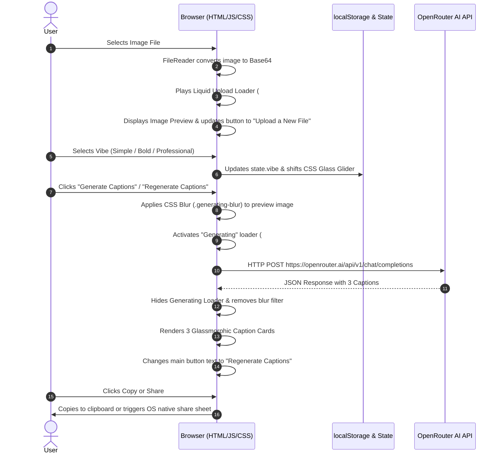

# Subtitle-Wallah-AI 🚀

Subtitle-Wallah-AI generates engaging social media captions using OpenRouter AI directly in your browser. No backend server or Python setup required!

# Subtitle-Wallah-AI: Complete Technical Architecture & Design System

A deep-dive technical breakdown of how **Subtitle-Wallah-AI** works under the hood — including tools, technology stack, complete execution workflows, and design system aesthetics.

---

## 🛠️ 1. Core Technology Stack

| Technology Layer | Tool / Standard Used | Purpose & Function |
| :--- | :--- | :--- |
| **Markup Layer** | **HTML5** | Provides semantic layout structure, accessibility anchors (`aria-live`), and input controls. |
| **Styling & FX Layer** | **Vanilla CSS3** | Delivers custom glassmorphic styling, HSL/RGB gradients, 3D transforms, and keyframe animations without external heavy UI frameworks. |
| **Logic & State Layer** | **Vanilla JS (ES6+)** | Handles reactive DOM updates, state management, asynchronous image reading (`FileReader`), and API HTTP orchestration (`fetch`). |
| **AI Vision Engine** | **OpenRouter API** | Connects to `nvidia/nemotron-3-ultra-550b-a55b:free` multimodal AI model with reasoning payload enabled. |
| **Browser Native APIs** | **FileReader API, Clipboard API, Web Share API** | Native web interfaces for offline file processing, one‑click clipboard copying, and OS native sharing. |

---

## 🔄 2. Step‑By‑Step Workflow & Data Flow



---

## 🎨 3. Design System & Aesthetics

### A. Color Palette
- **Background Theme**: Obsidian Dark (`#09090b`) & Dark Slate Window (`linear-gradient(180deg, #2a2a2d, #1d1f22)`).
- **Primary Action Gradient**: Warm Amber/Gold (`linear-gradient(135deg, #f6b73c, #ed8d3c)`).
- **Upload Container Gradient**: Vibrant Pink/Magenta (`linear-gradient(135deg, #f162ba, #ed45ae)`).
- **Glass Action Buttons**: Cyan/Sky Ice (`linear-gradient(135deg, #d0e7ff55, #a0d8ff)`).

### B. Glassmorphism Architecture
The UI relies on modern glassmorphism principles:
1. **Backdrop Blur**: `backdrop-filter: blur(12px)` for frosted glass effect.
2. **Semi‑Translucent Fills**: `rgba(255, 255, 255, 0.06)` for cards and input groups.
3. **Inset Light Borders**: `inset 1px 1px 4px rgba(255, 255, 255, 0.2)` creating physical glass edge depth.

### C. Glass Glider Mechanism
The Vibe Selector (`Simple`, `Bold`, `Professional`) uses pure CSS radio hacks and sibling selectors (`~`):
- Sliding physics driven by: `transition: transform 0.5s cubic-bezier(0.37, 1.95, 0.66, 0.56)`.\n- Radio `:checked` states shift the glider:\n  - `translateX(0%)` for Simple.\n  - `translateX(100%)` for Bold.\n  - `translateX(200%)` for Professional.

---

## ⚡ 4. AI Engine & Prompt Engineering Details

### Model Specification
- **Endpoint**: `https://openrouter.ai/api/v1/chat/completions`
- **Model ID**: `nvidia/nemotron-3-ultra-550b-a55b:free`
- **Reasoning Payload**: `extra_body: { reasoning: { enabled: true } }`

### Vision Prompt Payload Format
```json
{
  "model": "nvidia/nemotron-3-ultra-550b-a55b:free",
  "extra_body": { "reasoning": { "enabled": true } },
  "messages": [
    {
      "role": "user",
      "content": [
        { "type": "text", "text": "Generate exactly 3 unique social media captions for this image. Vibe: <vibe>. Make them natural, engaging, and highly relevant to the image. Return valid JSON in this format: {\\"captions\\":[\\"caption 1\\",\\"caption 2\\",\\"caption 3\\"]}. Keep each caption short, polished, and distinct." },
        { "type": "image_url", "image_url": { "url": "data:image/jpeg;base64,..." } }
      ]
    }
  ]
}
```

---

## 🧠 5. Key JavaScript Helpers

1. **`readFileAsDataUrl(file)`**: Wraps HTML5 `FileReader` in a Promise to safely convert raw browser File blobs to Base64 strings.
2. **`parseJsonCaptions(rawText)`**: Robust multi‑tier parser that strips Markdown codeblocks (```json```), attempts strict JSON parsing, and falls back to line‑by‑line regex parsing if the AI output contains surrounding text.
3. **`copyCaption()` & `shareCaption()`**: Implements modern Web APIs (`navigator.clipboard` & `navigator.share`) with automatic fallback fall‑throughs for unsupported devices.


[](https://app.netlify.com/projects/subtitlewallahai/deploys)
