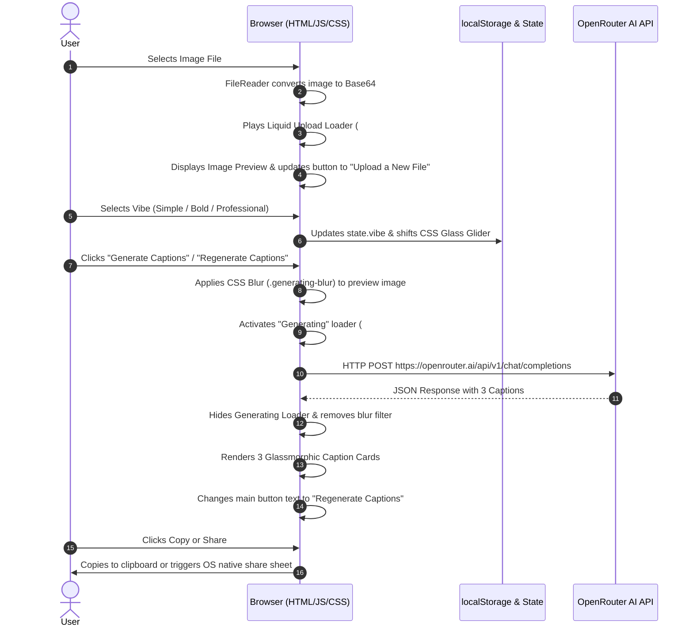

# Subtitle-Wallah-AI 🚀

Subtitle-Wallah-AI generates engaging social media captions using OpenRouter AI directly in your browser. No backend server or Python setup required!

# Subtitle-Wallah-AI: Complete Technical Architecture & Design System

A deep-dive technical breakdown of how **Subtitle-Wallah-AI** works under the hood — including tools, technology stack, complete execution workflows, and design system aesthetics.

---

## 🛠️ 1. Core Technology Stack

| Technology Layer | Tool / Standard Used | Purpose & Function |
| :--- | :--- | :--- |
| **Markup Layer** | **HTML5** | Provides semantic layout structure, accessibility anchors (`aria-live`), and input controls. |
| **Styling & FX Layer** | **Vanilla CSS3** | Delivers custom glassmorphic styling, HSL/RGB gradients, 3D transforms, and keyframe animations without external heavy UI frameworks. |
| **Logic & State Layer** | **Vanilla JS (ES6+)** | Handles reactive DOM updates, state management, asynchronous image reading (`FileReader`), and API HTTP orchestration (`fetch`). |
| **AI Vision Engine** | **OpenRouter API** | Connects to `nvidia/nemotron-3-ultra-550b-a55b:free` multimodal AI model with reasoning payload enabled. |
| **Browser Native APIs** | **FileReader API, Clipboard API, Web Share API** | Native web interfaces for offline file processing, one‑click clipboard copying, and OS native sharing. |

---

## 🔄 2. Step‑By‑Step Workflow & Data Flow

## 3. AI Engine & Prompt Engineering Details

### Model Specification
- **Endpoint**: `https://openrouter.ai/api/v1/chat/completions`

## 4. Model Used;
- **Model ID**
    'nvidia/nemotron-3-ultra-550b-a55b:free',
    'google/gemma-4-26b-a4b-it:free',
    'minimax/minimax-m3:free',
    'google/gemini-2.0-flash-001',
    'openai/gpt-4o-mini',
    'meta-llama/llama-3.2-11b-vision-instruct:free'

    Future models will be added as they become available on OpenRouter.

## Thank You for Using Subtitle-Wallah-AI! 🎉

